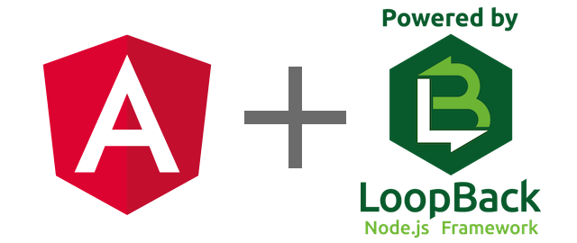

<!-- $size: 16:9 -->


## Angular Lisbon Meetup 8.11.2017
# Rapid App Development with Angular and LoopBack

<p style="text-align: center;">

</p>

João Ribeiro, joao@altar.io
Peter Bouda, peter.bouda@apiax.com

---


# About João

* Add description

---


# About Peter

* Web Developer since the 90s
* LoopBack + Angular since 2015
* Senior Web Architect at Apiax
* Standard password: *reactsucks*
* The rest is LEGO

---


# LoopBack Intro

* Quickly cerate REST APIs
* Based on Express.js
* Model-driven development
* IBM bought StrongLoop in 2015 and integrates LoopBack in their cloud offer (IBM API Connect)
* Comes with Android, iOS and Angular(JS) SDKs
* http://loopback.io

---


# LoopBack SDK Builder Intro

* A fork from the official AngularJS SDK to support Angular 2
* Generates front-end code to acccess back-end endpoints

```
this.accountApi.patchAttributes(userId, { email: newEmail });
```

* Real-time communication via FireLoop (think FireBase but with your own stack)
* ngrx and ORM support
* https://github.com/mean-expert-official/loopback-sdk-builder

---


# Get started with LoopBack CLI

Generate LoopBack app:
```
$ npm install -g loopback-cli
$ lb
? What's the name of your application? the-next-big-thing
? Enter name of the directory to contain the project: the-next-big-thing

? Which version of LoopBack would you like to use? 3.x (current)
? What kind of application do you have in mind?
                   api-server (A LoopBack API server with local User auth)

I'm all done. Running npm install for you to install the required dependencies.
If this fails, try running the command yourself.
```

---


# Windows preparation

* Two steps before building loopack-cli
* Install windows-build-tools
```
npm install --global --production windows-build-tools
```` 

* Install OpenSSL version 1.0.2L: https://slproweb.com/products/Win32OpenSSL.html

---


# Setup database

```
$ lb datasource
? Enter the data-source name: postgres
? Select the connector for postgres: PostgreSQL (supported by StrongLoop)
[...]
```

* Support for different database types as MySQL, PostgreSQL, MongoDB, etc.
* Installs a LoopBack Connector module
* Configure via JSON files (datasources.json)
* Mail is "datasource", too

---


# Generate models

```
$ lb model
```

* Models consist of JSON description and optional JS
* Make a model public and you will get all the REST endpoints
* Fined-gained control to disable and restrict endpoints
* Access Control Lists to allow access to user roles
* Define model relations
* Custom remote methods
* LoopBack API Explorer to exercise all the generated API endpoints

---


# Generate Angular SDK

```
$ npm install --save @mean-expert/loopback-sdk-builder
$ ./node_modules/.bin/lb-sdk server/server.js client/src/app/shared/sdk
```

* NativeScript support
* Real-time communication support
* React support :P
* Generates front-end code for:
  * Models
  * Services
  * Local storage (for auth)

---


